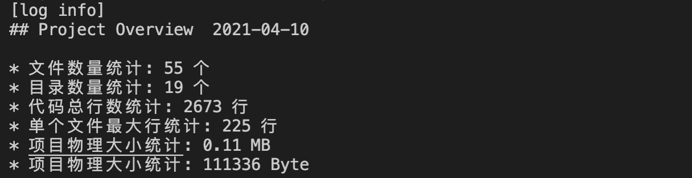

# pot

<p align="center">
  <a href="https://npmjs.com/package/z-pot" title="Version">
    
  </a>
  <a href="https://npmjs.com/package/z-pot" title="Downloads">
    
  </a>
  <a>
  
  </a>  
  <a a href='https://coveralls.io/github/fancylife/z-pot?branch=master'></a>

</p>

z-pot is a project overview tool, used to analyze the amount of code, the number of files, code statistics and so on.

## 快速开始

install `z-pot`

```shell
npm i -g z-pot
```

create report

```shell
cd ${yourProject}

pot report
```



## Features

-   [x] file stats
-   [x] custom
-   [x] unit test
-   [] stat group by file type
-   [] stat group by file line count
-   [] stat tech stack of project
-   [] stat of project contributor

## 使用指南

```shell
Usage: pot <command> [options]

project overview tool

Options:
  -V, --version     output the version number
  -h, --help        output usage information

Commands:
  report [options]  print project info

  Examples:

    $ pot report ## build report
    $ pot report -t xxx ## custom report template

```

### 自定义模板

Template Context

```
  this.statInfo = {
        createdTime: moment(new Date()).format('YYYY-MM-DD'),
        fileSize: 0, // project file size
        filesCount: 0, //files count
        dirsCount: 0, //dir count
        fileLineCount: 0, //the count of all files
        maxFileLine: 0, // single file max line count
        bigFilesList: [] //big files list
    }
```

Custom Template `report.template.html`

```html
<!DOCTYPE html>
<html lang="en">
    <head>
        <meta charset="UTF-8" />
        <meta http-equiv="X-UA-Compatible" content="IE=edge" />
        <meta name="viewport" content="width=device-width, initial-scale=1.0" />
        <title>Document</title>
    </head>
    <body>
        ${this.statInfo.createdTime}
    </body>
</html>
```

```shell
pot report -t ./tests/report.template.html ## 指定模板

ls pot_report_2021-04-05.html ## 产物
```

# License

[MIT](https://opensource.org/licenses/MIT)

Copyright (c) 2013-present, zhangchi
